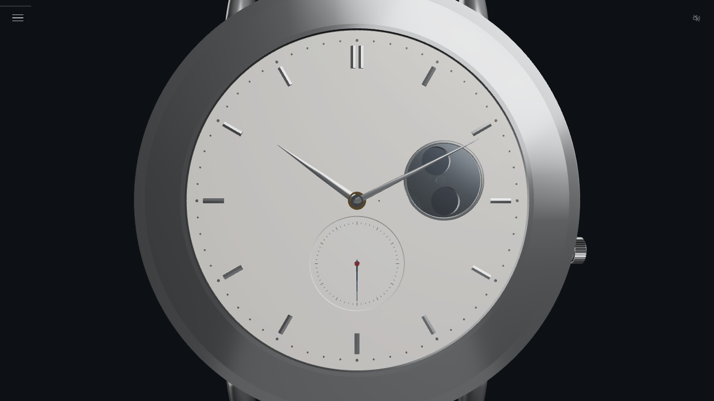
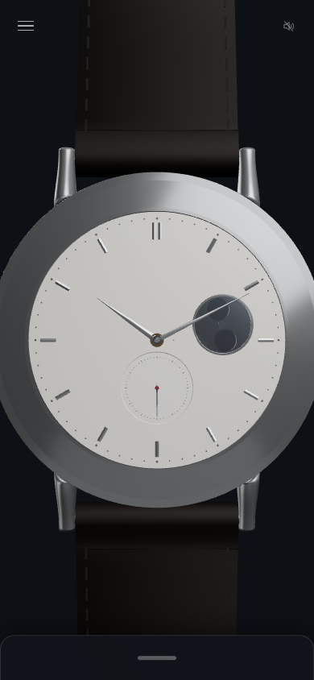

# 機械式時計 Study Model

**Mechanical Watch Study Model**

ETA 6498-1級の大型手巻きムーブメントを参照し、機械式時計の構成、動力伝達、巻上げ、時刻合わせ、脱進機、調速機をブラウザ上で観察できる教育用3Dシミュレーションです。Three.jsとWeb Audioで構築しています。

**▶ [ブラウザで試す](https://showhey04-oss.github.io/mechanical-watch-3d/)** — インストール不要

> **プロトタイプ版について**  
> 本リポジトリは `v3.15.0` の本体完成済みプロトタイプです。main body-completion Headは `eb4595e040786e0e2115165d36a9cc39e08b2038`、Nodeは477/477・fail 0・skip 0です。現行アーキテクチャでの機能追加は凍結し、比較queryと診断経路は履歴資産として保持します。Issue #2はaccepted limitationとして`not planned`で終結し、PR #5はsuperseded／未マージで終結しました。追加実装は現行prototypeでは計画せず、後継版 **mechanical-watch-3d-rebuild（準備中）** へ引き継ぎます。開発工程、承認Head、寸法、試験結果、候補の採否は [Phase History](docs/PHASE_HISTORY.md) に全量保存しています。

| 完成時計・デスクトップ | モバイル表示 |
|:--:|:--:|
|  |  |

## できること

- **時計を動かす** — 巻上げ、逆転空転、時刻合わせ、秒停止、現在時刻設定、パワーリザーブを操作できます。
- **機構を全方向から観察する** — 10種のカメラプリセット、回転、ズーム、表裏分離、分解表示、断面クリップ、透過表示を利用できます。
- **部品群を層別表示する** — 地板・受、輪列、脱進機、テンプ、巻上げ伝達、文字板側機構、表面表示、外装など10種の表示グループを個別に切り替えられます。
- **動力経路を追う** — 全機構、香箱から輪列、脱進機・調速機、巻上げ伝達系、表面・文字板表示、文字板側機構・時刻合わせの6系統を表示できます。
- **部品を学ぶ** — 部品選択、名称・機能の説明、材質凡例、噛合い・軸受ガイドを利用できます。
- **時計の状態を確認する** — 主ゼンマイトルク、伝達効率、テンプ振幅、歩度、姿勢差、ビートエラー、履歴グラフを確認できます。
- **時間を進めて挙動を見る** — 時間経過倍率とシミュレーション操作により、パワーリザーブと歩度の変化を観察できます。
- **機構同期音を聴く** — テンプ、巻上げ、逆転空転、りゅうず操作に同期する合成音を再生できます。音は初期状態でOFFです。

デスクトップとスマートフォンに対応し、iPhoneのマルチタッチ操作、画面復帰後の作動音再開、モバイル全長表示を確認しています。

## 基本操作

- ドラッグ／一本指：カメラ回転
- ホイール／ピンチ：ズーム
- 二本指：パン
- 部品をタップ：部品選択と説明表示
- 左上メニュー：操作、学習、技術の各パネル
- 右上スピーカー：作動音のON／OFF

旧通常表示は `?defaultProfile=legacy` を付けたURLで確認できます。比較・診断用のqueryフラグは、プロトタイプの検証履歴として削除せず残しています。

## ローカル実行

`index.html` はThree.jsをCDNから読み込むため、実行時にインターネット接続が必要です。

```bash
git clone https://github.com/showhey04-oss/mechanical-watch-3d.git
cd mechanical-watch-3d
python3 -m http.server 8000
```

ブラウザで `http://localhost:8000/` を開きます。Windowsでは `py -m http.server 8000` も使用できます。

Node.jsによる自動試験は次で実行します。

```bash
npm test
```

## 既知の制約

- 文字板上に矩形状の影が見える場合があります。
- 透過率 `100% → 99%` では `transparent` フラグの切替により表示が不連続になります。
- 透過率 `55% → 54%` では `depthWrite` の切替により表示が不連続になります。
- 透過表示では暗部や深度順序が不自然になる場合があります。順不同半透明描画（OIT）を実装していないことが主因で、影、fog、DPRのパラメータ調整だけでは根本解決できません。
- `100% → 99%` と `55% → 54%` の不連続は深度順序とは別問題で、透過率の閾値に応じて `transparent`／`depthWrite` を実行時に切り替える設計に起因します。
- PCとiPhoneでは照明の見え方が異なり、既定照明が実機で暗く見える場合があります。
- モバイルで時計全長までズームアウトすると、遠景fogにより暗く見える場合があります。

外部レビューで動画24フレームを確認した範囲では、矩形影や明白な深度順序の誤りは観察されませんでした。文書化した症状は、通常の見え方では軽微な場合があります。

## モデルの位置付け

本モデルはETA 6498-1級を参照した教育用・可視化用の模式モデルです。実機の複製、製造用CAD、時計修理用資料、完全なデジタルツインではありません。歯形、クリアランス、ばね特性、摩擦、潤滑、接触、弾性変形、干渉診断、作動音には教育表示上の近似を含みます。

## ドキュメント

- [工程履歴・承認状態・試験記録](docs/PHASE_HISTORY.md)
- [プロジェクト概要](docs/PROJECT_OVERVIEW.md)
- [ロードマップ](docs/ROADMAP.md)
- [受入試験](docs/ACCEPTANCE_TESTS.md)
- [完成時計の既定採用](docs/FINAL_COMPLETED_WATCH_DEFAULT_ADOPTION.md)
- [機構同期作動音](docs/MECHANICAL_SOUND_SYSTEM.md)

## ライセンス

本リポジトリのソフトウェアは [MIT License](LICENSE) で公開します。
