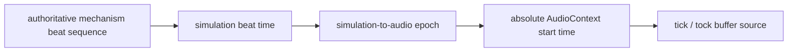

# Final Stabilization Phase 3B.4c — iOS balance audio pacing

## 結論

Phase 3B.4cでは、物理iPhoneで約1分後からテンプ音が遅く聞こえる現象を
`FRAME_CROSSING_AUDIO_EVENT_DELAY` と分類した。

現行経路は、機構のbeat crossingを `requestAnimationFrame` 内で検出した時点で
tick／tockを即時再生する。描画frameがbeat境界を遅れて通過すると、その遅れが
発音間隔へ直接現れる。一方、AudioContext clock stall、beat sequence重複、
backlog burst、独立した音響時計は今回の測定では検出されなかった。

修正候補はquery限定であり、通常経路へは採用していない。自動技術ゲートには合格したが、
物理iPhoneでの15分聴感確認は未実施であるため、正式判断は
`STOPPED_PHYSICAL_IPHONE_AUDIO_REPRODUCTION_INCONCLUSIVE` とする。

## 対象query

共通条件:

```text
?exterior=balanced
&watchHead=phase3c1
&strapStyle=phase3c2
&integration=phase3c3
&rendering=issue2-d2c3
&continuity=issue2-current
&framing=issue2-mobile-full-length-fit
&input=issue2-ios-multitouch-stability
```

診断:

```text
&audioTiming=phase3b4c-diagnostics
```

修正候補:

```text
&audioTiming=phase3b4c-stability
```

`audioTiming` がない場合、不完全なquery、または値が不正な場合は既存音響経路を維持する。

## 原因監査

機構側の `studyBeat` と `escapementBeatRate` をbeat identityと周期の正本として維持した。
音声sample、master gain 0.36、各bus gain、機構速度、rate model、balance amplitude、
beat errorは変更していない。

基準方式では、frame crossing検出後にsourceを即時開始するため、frame pacingの揺れが
発音予定間隔の揺れになる。3分foreground実測は次のとおり。

| 経路 | 期間 | event | 平均cadence誤差 | p95予定間隔偏差 | duplicate | backlog | clock stall |
|---|---:|---:|---:|---:|---:|---:|---:|
| diagnostics baseline | 180.217秒 | 610 | 47.360% | 101.859ms | 0 | 0 | 0 |
| stability candidate | 180.135秒 | 900 | 0.060% | 20.590ms | 0 | 0 | 0 |

通常beat intervalは0.200秒である。候補は平均誤差1%以下を満たし、p95偏差も
beat intervalの15%（30ms）以下である。

## 修正方式

候補は、機構beatを音響から独立したtimerやoscillatorで模擬しない。



- beat sequenceを単調増加する一意IDとして扱う
- simulation beat timeとAudioContext currentTimeからepochを評価する
- source nodeを絶対AudioContext時刻で短く先行予約する
- lead、look-ahead、late toleranceはbeat intervalから導出する
- 過去beatはまとめて再生せず、late-drop後に将来beatへ再同期する
- pending sourceは4件を上限とする
- current-time設定、manual time設定、pause、stop seconds、sound OFF、
  visibility／page lifecycle、AudioContext異常でpendingを破棄してre-anchorする
- 診断OFF／音OFFではAudioContext clock確認やpending inventory更新を毎frame実行しない

0.200秒beatに対する導出値は、minimum lead 0.018秒、maximum look-ahead 0.600秒、
late tolerance 0.050秒である。

## AudioContext watchdog

`AudioContext.state === "running"`だけを根拠にせず、wall clock deltaと
`AudioContext.currentTime` deltaを比較する。`getOutputTimestamp` は利用可能な場合だけ
診断へ含める。

clock stall検出時は、機構とUIを停止せず、新規予約を止め、pending sourceとbacklogを
破棄する。自動resumeの無限loopは行わない。今回のforeground、current-time、mixed、
lifecycle測定ではclock stallは0件だった。

## current-time／lifecycle

- current-time設定: 60秒後に1回適用し、さらに120秒継続。903イベント、
  平均誤差0.229%、p95偏差は実質0ms、duplicate／late／backlog 0。
- 操作混在: 60秒。巻上げ、空転、位置1／2を混在し、305イベント、
  平均誤差0.405%、duplicate／late／backlog 0、禁止干渉0。
- lifecycle: visible→hidden→visibleを含む30秒。hidden中のbacklogと復帰時catch-upは0。
  意図的な無音区間はcadence gateの対象外とした。

バックグラウンド中の経過時間復元は実装していない。
`DEFERRED_SUSPENDED_TIME_STATE_RESTORATION_PHASE3B4D` として次工程へ送る。

## 性能差分

各条件3回の中央値で比較した。

| viewport | 経路 | average FPS | p50 | p95 | p99 | >33ms | >50ms |
|---|---|---:|---:|---:|---:|---:|---:|
| desktop | protected | 22.807 | 49.6ms | 51.3ms | 51.8ms | 183 | 62 |
| desktop | candidate | 22.794 | 49.7ms | 51.1ms | 51.6ms | 180 | 63 |
| 390×844 | protected | 59.899 | 16.7ms | 18.2ms | 18.5ms | 0 | 0 |
| 390×844 | candidate | 59.902 | 16.7ms | 18.2ms | 18.6ms | 0 | 0 |

desktopのFPS差は-0.057%、p95差は-0.2ms、mobileのFPS差は+0.004%、
p95差は実質0msであり、差分ゲートに合格した。in-app Browserで既知のA.6絶対性能未達は
protected側でも同一であり、候補固有回帰ではない。

## 回帰

- Node: 309/309
- desktop comprehensive: 81/86
- 390×844 comprehensive: 85/88
- UI: desktop 20/20、mobile 22/22
- HUD: desktop 45/45、mobile 57/57
- trusted audio: desktop 23/23、mobile 23/23
- A.7: 9/9
- 位置1／位置2禁止干渉: 0/0
- S86、Phase 2C、三針拘束: 維持
- console error／warning: 0/0

desktopの5件とmobileの3件は、D2c3の既知A.5照明契約およびin-app Browserの
A.6絶対性能であり、protected経路でも同一だった。候補固有失敗は0件。

## protected path

Part A固定コミット `d6718e59a2438152a4a203fa579b66ce6e91ecd3` と比較した。

- desktop 1280×720: 34,187 bytes、
  SHA-256 `d9f81564d986bbfc90cde004de59d65e9ca799272232ed763d41b4caafc4ba47`
- mobile 390×844: 21,377 bytes、
  SHA-256 `4ec1d51977215c62db4c774641b66fbad6d27d100b912ec4233eb02c6491d25b`

base／candidateは両viewportでbyte・SHA・pixel exact一致した。

## 物理iPhone確認

既存音響ではShadow-off、D2c3、D2c3＋framing＋multi-touch候補のいずれでも
約1分後に遅れが再現し、現在時刻設定1回でも解消しなかった。

候補は物理iPhoneでは未実施である。次を人間が15分確認するまで、
`IOS_BALANCE_AUDIO_PACING_TECHNICAL_FINALIST` または
`HUMAN_ACCEPT_IOS_BALANCE_AUDIO_PACING_FIX` を付与しない。

- 初期1分、1〜3分、3〜10分、10〜15分のtick／tock速度と交互性
- 二重発音、欠落、catch-up
- current-time設定、秒停止／復帰
- 巻上げ、空転、pull／push
- multi-touch、Safari reload、WebGL消失、発熱

## 未変更

D2c3照明、PMREM、fog、framing、multi-touch、Geometry、Material、shadow、
transparent／depthWrite、camera、UI、HUD、音声sample、gain、機構速度、
APP_VERSION、試験閾値は変更していない。Issue #2はOpen、PR #5はOpen／Draft、
D2c3・framing・multi-touch・本候補はいずれも既定未採用である。
