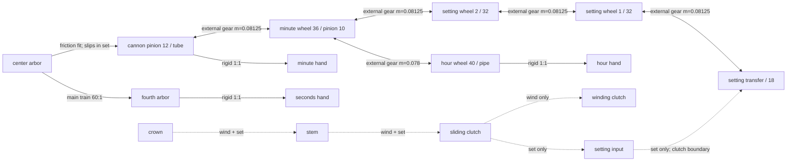

# Refactor A.3 motion-work topology

## Topology

Solid links are permanent physical connections. Dashed links are conditional
clutch connections. Arrowheads show the normal source direction; all external
gear pairs in the permanent dial train allow reverse propagation.

## Permanent dial train

| Mesh | Module | Teeth | Pitch radii | Centre distance | Axial band |
| --- | ---: | ---: | ---: | ---: | ---: |
| cannon pinion → minute wheel | 0.08125 | 12 / 36 | 0.4875 / 1.4625 | 1.9500 | -1.05 |
| minute pinion → hour wheel | 0.07800 | 10 / 40 | 0.3900 / 1.5600 | 1.9500 | -1.47 |
| minute wheel → setting wheel 2 | 0.08125 | 36 / 32 | 1.4625 / 1.3000 | 2.7625 | -1.05 |
| setting wheel 2 → setting wheel 1 | 0.08125 | 32 / 32 | 1.3000 / 1.3000 | 2.6000 | -1.05 |
| setting wheel 1 → setting transfer | 0.08125 | 32 / 18 | 1.3000 / 0.73125 | 2.03125 | -1.05 |

Each pitch radius is derived from `module × teeth / 2`; it is not entered as an
independent tuning value. The two meshes on the compound minute-wheel arbor have
the same 1.95 centre distance even though their modules differ.

## Source and clutch rules

| Crown position | Permanent source | Conditional path | Isolated boundary |
| --- | --- | --- | --- |
| position 1 / normal (`run`) | centre train | crown → stem → sliding → winding clutch remains engaged but stationary | setting input → setting transfer open |
| position 1 / winding | centre train remains authoritative | crown → stem → sliding → winding clutch | setting input → setting transfer open |
| position 2 / setting | setting input through setting transfer | crown → stem → sliding → setting input → setting transfer | centre → cannon friction fit slips |

The setting transfer, setting wheel 1, and setting wheel 2 therefore rotate in
position 1 from the display train. The setting input, sliding clutch, stem, crown,
and winding clutch do not receive display backdrive.

## Incremental ratios

With a centre/cannon input increment of `1` in position 1:

| Node | Gain |
| --- | ---: |
| cannon | 1 |
| minute | -1/3 |
| hour | 1/12 |
| setting wheel 2 | 3/8 |
| setting wheel 1 | -3/8 |
| setting transfer | 2/3 |
| fourth arbor / seconds hand | 60 |

With a crown input increment of `1` in position 2, the cross-axis crown clutch
reverses direction:

| Node | Gain |
| --- | ---: |
| setting input | 1 |
| setting transfer | -1 |
| setting wheel 1 | 9/16 |
| setting wheel 2 | -9/16 |
| minute | 1/2 |
| cannon / minute hand | -3/2 |
| hour / hour hand | -1/8 |

## Continuity

`resolveMotionWorksState()` evaluates both crown positions. `applyMotionWorksState()`
is the only runtime writer for the motion works, fourth arbor, clutch objects, and
three hand groups.

- On position 1 → 2, the `setting-input-transfer` engagement offset is captured
  from the current transfer and crown angles.
- On position 2 → 1, the `center-cannon-friction` slip offset is captured from
  the current cannon and centre angles.
- Nodes unreachable from the selected source retain their previous Object3D
  angle. Thus the centre/fourth train and seconds hand remain stopped while the
  hands are set.
- Hand angles use a fixed assembly offset from the actual cannon tube, hour pipe,
  and fourth arbor; time values never write hand rotations directly.
- `run`, `wind`, and `set` are explicit graph states. Every permanent connection
  declares all three; only the two clutch branches change their active state.
- Live-sync ON captures the current clock offset and removes it through a bounded
  1.5-second smooth transition; OFF retains the current resolver angle. Neither
  toggle introduces a second hand writer or an instantaneous angle jump.
