# Refactor A.4 winding topology

## Physical path

Solid arrows are active in position 1. The setting branch is active only in
position 2. The one-way boundary accepts positive winding input and holds the
downstream train during reverse crown motion.

```mermaid
flowchart LR
  crown["crown (X)"] -->|"rigid 1:1"| stem["stem (X)"]
  stem -->|"square 1:1"| sliding["sliding clutch (X)"]
  sliding -->|"position 1 face clutch"| clutch["winding clutch (X)"]
  clutch -->|"short sleeve 1:1"| pinion["winding pinion 10 (X)"]
  pinion -->|"one-way orthogonal crown mesh +1:4"| crownWheel["compound crown wheel 40 (Y)"]
  crownWheel -->|"external mesh -2:3"| ratchet["ratchet wheel 60 (Y)"]
  ratchet -->|"square fit 1:1"| arbor["barrel arbor (Y)"]
  arbor -->|"drum minus arbor -1:1"| spring["mainspring wind"]
  drum["barrel drum (Y, train writer)"] -->|"drum minus arbor +1:1"| spring

  sliding -. "position 2 face clutch" .-> setting["setting input (X)"]
```



## Nodes and Object3D ownership

| Node | Axis | Real Object3D | Runtime writer |
| --- | --- | --- | --- |
| crown input | X | crown group | `applyWindingState()` |
| stem | X | continuous stem group | `applyWindingState()` |
| sliding clutch | X | two-position clutch | `applyWindingState()` |
| winding clutch | X | fixed face clutch | `applyWindingState()` |
| winding pinion | X | 10-tooth short pinion and sleeve | `applyWindingState()` |
| crown wheel | Y | lower crown gear, vertical arbor, upper spur gear | `applyWindingState()` |
| ratchet wheel | Y | 60-tooth wheel with square socket | `applyWindingState()` |
| barrel arbor | Y | independent arbor assembly and square | `applyWindingState()` |
| mainspring | relative | spring line derived from arbor/drum state | `applyWindingState()` / spring geometry update |
| setting input | X | compact setting-input clutch | `applyWindingState()` |
| barrel drum | Y | independent drum and first wheel | going-train writer only |

`applyMotionWorksState()` does not write any winding node. The barrel root itself
is fixed, so the drum and arbor angles cannot be accidentally added through a
parent transform.

## Gear and contact geometry

The common winding module is `0.082`.

| Pair | Axes | Teeth | Pitch radii | Ratio | Centre/contact | Axial band |
| --- | --- | ---: | ---: | ---: | --- | ---: |
| winding pinion -> lower crown teeth | X / Y | 10 / 40 | 0.41 / 1.64 | +1/4 | exact pitch contact `[-3.11531731, -0.64, -4.50]` | Y = -0.64 |
| upper crown gear -> ratchet wheel | Y / Y | 40 / 60 | 1.64 / 2.46 | -2/3 | centre distance 4.10 | Y = 3.08 |
| ratchet wheel -> barrel arbor | Y / Y | square fit | — | 1 | coaxial on `[-4.10, 1.12]` in XZ | ratchet/arbor socket |

The compound crown-wheel centre is `[-3.11531731, -2.86]` in XZ. The ratchet and
barrel-arbor centre remains the original `[-4.10, 1.12]`. Only X/Z placement was
changed; the stem, dial, and winding Y bands were not moved.

The lower crown gear starts at one half of a 40-tooth pitch, so the pinion tooth
centre meets a crown-wheel gap. The positive orthogonal ratio accounts for the
rendered pinion's local axis becoming world `-X`; the following external mesh is
negative. The upper gear phase is calculated from tooth counts and the actual
centre-line angle. Runtime verification checks module equality, pitch radii,
centre distance, axial overlap, and both live Object3D tooth-phase residuals.

## Connection table

| Connection | State | Ratio | Boundary behavior |
| --- | --- | ---: | --- |
| crown -> stem | wind, set | 1 | rigid |
| stem -> sliding clutch | wind, set | 1 | square drive |
| sliding -> winding clutch | wind only | 1 | opened in position 2 |
| winding clutch -> winding pinion | wind only | 1 | short rigid sleeve |
| winding pinion -> crown wheel | wind only | +1/4 | one-way forward input |
| crown wheel -> ratchet wheel | wind only | -2/3 | permanent downstream external mesh |
| ratchet wheel -> barrel arbor | wind only | 1 | square fit |
| barrel arbor -> mainspring | run, wind, set | -1 | `drum - arbor` energy input |
| barrel drum -> mainspring | run, wind, set | +1 | read-only going-train energy input |
| sliding clutch -> setting input | set only | 1 | opened in position 1 |

For a positive crown increment of `1 rad`, the resolved gains are:

| Node | Gain |
| --- | ---: |
| crown, stem, sliding, winding clutch, winding pinion | 1 |
| crown wheel | +1/4 |
| ratchet wheel, barrel arbor | -1/6 |
| mainspring relative wind | +1/6 |
| setting input | 0 |

## State behavior

### Position 1, no crown input

- The going train rotates the barrel drum and display train.
- Crown, pinion, crown wheel, ratchet, and arbor remain stationary.
- The normal train cannot backdrive the winding graph.

### Position 1, forward crown input

- Every Object3D from crown through barrel arbor follows the tabled ratios.
- The setting input remains stationary.
- The barrel drum and hand speeds receive no crown increment.
- Negative arbor motion increases `drum - arbor` relative wind and reserve.
- Ratchet state is `engaged`; click/spring pose follows ratchet tooth phase.

### Position 1, reverse crown input

- Crown, stem, sliding clutch, winding clutch, and pinion rotate in reverse.
- Crown wheel, ratchet, and arbor hold their previous angles.
- The single one-way boundary is inactive; the permanently meshed/rigid
  downstream connections remain structurally active but unreachable from the crown.
- Ratchet state is `freewheel`; reserve does not decrease from reverse crown input.

### Position 2

- The sliding/winding-clutch boundary opens.
- Pinion, crown wheel, ratchet, and arbor hold their previous angles.
- Crown, stem, and sliding clutch drive the setting input only.

## Barrel energy state

`getBarrelEnergyState()` reports three separate angles:

```text
barrelArborAngle
barrelDrumAngle
relativeWindAngle = barrelDrumAngle - barrelArborAngle
```

The runtime reserve increment is derived only from the resolver's forward arbor
winding increment. A wrapped or explicitly changed barrel-drum angle updates the
diagnostic relative state but cannot add reserve. Going-train reserve consumption is suspended while a crown
input is active, so winding cannot change hand speed and reverse freewheel cannot
apply a crown-driven unwind.
